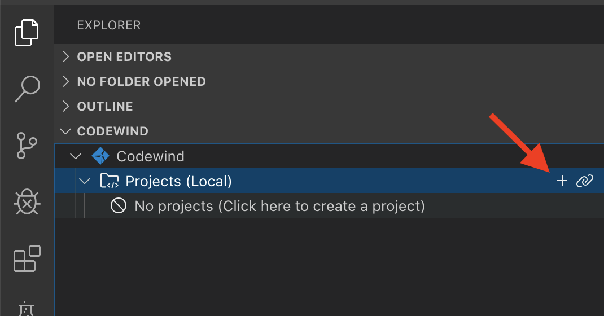
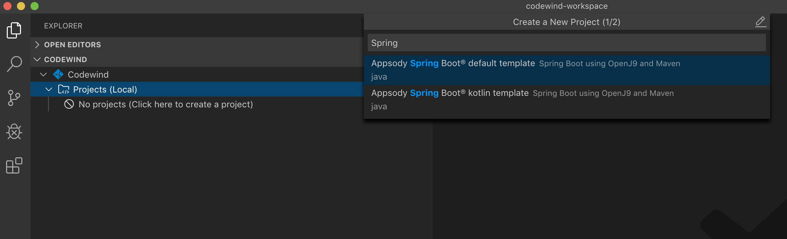
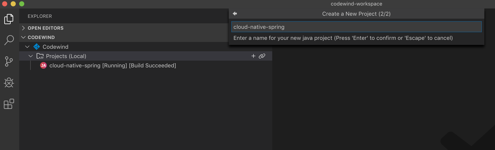
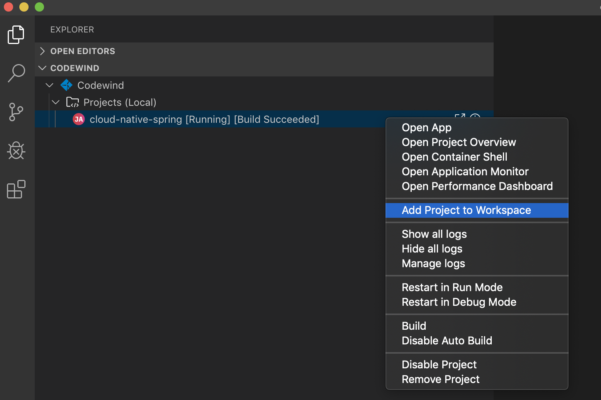
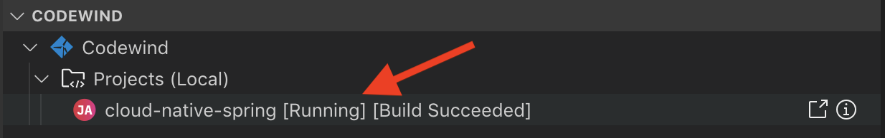
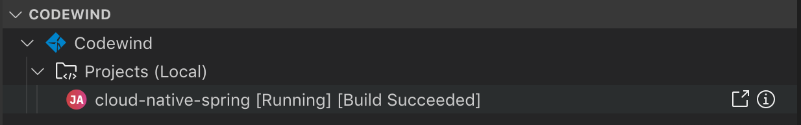

# Spring Appsody Codewind Quicklab

Moving workloads to the cloud introduces a steep learning curve for developers accustomed to traditional web application developmenr. Cloud-native applications are usually containerized (either Docker or OCI containers) and are run on orchestrated platforms like Kubernetes. These are complex technologies that bring big changes to the development workflow. Can this be simplified? Can developers create cloud-native applicatioons and deploy them to Kubernetes without climbing the mountainous learning curve? 

In this quicklab we will take a look at an usecase involving "Appsody and Codewind", two technologies that simplify development of containerized cloud-native applications. Appsody provides self-contained stacks for creating, building, and deploying cloud-native applications in a consistent and customized way for teams and organizations. Eclipse Codewind is an IDE plugin that allows you to work with containerized applications in a familiar way.

Appsody and Codewind allow developers to start building cloud-native applications like an expert without having to be an expert in all the cloud-native technologies. 

## Prerequistes

If you're running this lab on your own laptop, we need to pre-install some tools.

<details>
  <summary>Click to expand</summary>
  
### Configure Local System

This quicklab requires the following tools: 

1. Install Docker
2. Install minikube
3. Install Appsody
4. Install VS Code
5. Install VS Code codewind extension
6. Install VS Code java extension

We recommend working with the latest available version of each.

</details>

## Getting Familiar with Appsody

[Appsody](https://appsody.dev/) is a command-line interface for creating, building, and deploying cloud-native projects. Let's look at how to use Appsody to initialize a Spring Boot project. 

Appsody uses a concept called "stacks". The appsody CLI defines a few simple commands that work with defined stacks to create, run, test, debug, build, and deploy applications to Kubernetes. To view available stacks run the following command:

```
$ appsody list
```

This prints out a list of available stacks including the repo they are being pulled from, their version, and the different types of templates. For example `java-spring-boot2` could be initialized as either a Java application "default" or a Kotlin application.

```
REPO        	ID                       	VERSION  	TEMPLATES        	DESCRIPTION                                              
appsodyhub  	java-microprofile        	0.2.12   	*default         	Eclipse MicroProfile on Open Liberty & OpenJ9 using Maven
appsodyhub  	java-spring-boot2        	0.3.10   	*default, kotlin 	Spring Boot using OpenJ9 and Maven                       
appsodyhub  	nodejs                   	0.2.5    	*simple          	Runtime for Node.js applications                         
appsodyhub  	nodejs-express           	0.2.5    	*simple, skaffold	Express web framework for Node.js                        
appsodyhub  	nodejs-loopback          	0.1.4    	*scaffold        	LoopBack 4 API Framework for Node.js                     
appsodyhub  	python-flask             	0.1.3    	*simple          	Flask web Framework for Python                           
appsodyhub  	swift                    	0.1.4    	*simple          	Runtime for Swift applications                           
experimental	java-spring-boot2-liberty	0.1.7    	*default         	Spring Boot on Open Liberty & OpenJ9 using Maven         
experimental	nodejs-functions         	0.1.3    	*simple          	Serverless runtime for Node.js functions                 
experimental	quarkus                  	0.1.5    	*default         	Quarkus runtime for running Java applications            
experimental	vertx                    	0.1.1    	*default         	Eclipse Vert.x runtime for running Java applications   
```

Organizations will have their own specific needs and requirements. For which custom stacks can be created, however Appsody has several pre-defined stacks as well. To view available stacks run this command:

``` 
appsody repo add incubator https://raw.githubusercontent.com/seabaylea/stacks/javametrics-dev/index.yaml
```

## Improving Developer Productivity with Eclipse Codewind

[Eclipse Codewind](https://www.eclipse.org/codewind/) is a plugin for IDEs, currently available in VS Code, Eclipse, and Eclipse Che, that helps improve developer productivity when developing containerized applications. Let's explore how Codewind can help you be a more productive developer.

1. Open VS Code (press **command** + **space bar** and type "VS Code" into the dialog box)
2. In the explorer window under **CODEWIND** click on the "**+**" to create a new project


3. In the dialog pop-up search for "Spring Boot" and select the "Appsody Spring Boot default template" option


4. Enter **cloud-native-spring** as the project name and hit enter


### Automated Code Reload

A key to increasing developer productivity is shortening and reducing the friction in the feedback loop. `appsody run` will run the Spring application in the foreground, using Spring DevTools to restart the application in the container when changes have been detected. Codewind brings this appsody capability into the IDE in a familiar way.  

Let's look at this feature in action.

3. In VS Code add the **cloud-native-spring** project folder to the workspace
	
4. 	In the project under **src/main/java/application** create a new file **Hello.java**
5. Edit **Hello.java** to look like below:
	
	```java
	package application;
	
	import org.springframework.web.bind.annotation.RequestMapping;
	import org.springframework.web.bind.annotation.RestController;
	import org.springframework.web.bind.annotation.RequestParam;
	import org.springframework.http.HttpStatus;
	import org.springframework.http.ResponseEntity;
	import org.springframework.web.bind.annotation.ResponseBody;
	import java.util.ArrayList;
	import java.util.List;
	
	@RestController
	public class Hello {
	
	    @RequestMapping("v1/hello")
	    public @ResponseBody ResponseEntity<String> example(@RequestParam("name") String name) {
	        List<String> list = new ArrayList<>();
	        //return a simple list of strings
	        String msg = "Hello " + name;
	        list.add(msg);
	        System.out.println("New message: " + msg);
	        return new ResponseEntity<String>(list.toString(), HttpStatus.OK);
	    }
	
	}
	```
6. You can view the status of the re-build and re-deploy by looking at the status indicator next to the project under the Codewind context. Once status returns to [Running][Build Suceeded] you can refresh your browser window to view the change we made. Please be aware that it can take a few seconds until something happens. 
		
1. In VS Code click the "go to application" icon	
2. Append `/v1/hello?name=Cloud%20Native%20Spring` to the end of the url

### Viewing Application Logs

Viewing the logs of your application running in a docker container is easy from the IDE with Codewind. 

To view the logs for an application, right click on it and select "Show All Logs" 


The logs for the running application will be shown in the IDE console log window on the bottom right of the page. 

### Deploying an Application to Kubernetes with Appsody 

The cloud native world demands developer learn a lot of new skills that traditionally they didn't need understand before. Appsody helps to reduce this learning curve by helping with tasks like deploying to a kubernetes cluster. Let's deploy the application we have been building in this quicklab to a local kubernetes cluster!

1. Make sure that you are in the correct folder before starting your minikube cluster: 

	```
	cd “~/codewind-workspace/Cloud Native Spring”
	```

1. Now we will need to start our minikube cluster:

	```
	minikube start
	```

1. Next we will need to setup docker registry for the local minikube cluster, so that minikube can pull the image we will be sending it in the next step. To do that run the following command:

	```
	eval $(minikube docker-env)
	```

1. To deploy the application we just created to a kubernetes cluster, in this case a locally running instance of [minikube](https://github.com/kubernetes/minikube), run the following command:

	```
	appsody deploy
	``` 

1. Once the deploy has completed, we will need to tell minikube to expose the service, to do this run the following command:

	```
	minikube service cloud-native-spring
	```

Minikube will expose the service and open a browser window allowing you to view the application we just deployed.

Appsody and Codewind help Java developers create, build, and deploy cloud-native applications without having to be experts in cloud native development!

